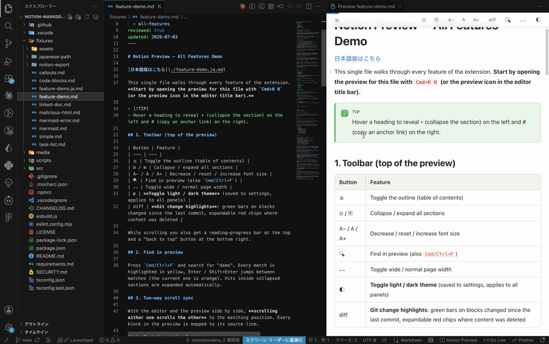

# Notion-like Markdown Preview

Preview Markdown and Notion-exported documents in a clean, Notion-like UI inside
VS Code. This extension is **read-only** by design — it does not re-implement
Notion's editor, database, or collaboration features. It simply makes the
documents you already write feel good to read inside the editor.

<p align="center">
  
</p>

## Features

- 🪶 Notion-like Markdown preview (centered page, generous spacing, readable width)
- 🎨 Follows your VS Code light/dark theme automatically — or toggle light/dark
  from the ◐ toolbar button (also: **Notion Preview: Toggle Light/Dark Theme**)
- 🗂️ Open previews for several Markdown files at once — each file keeps its own panel
- 💻 Code blocks with a language label and a copy button (syntax highlighting via [Shiki](https://shiki.style/))
- 📊 Mermaid diagrams rendered locally — **no external CDN**
- 🖼️ Notion-export image support (URL-encoded paths, same-name / `.assets` folders, Japanese file names)
- 💡 Callouts (`> [!NOTE]`, `[!TIP]`, `[!IMPORTANT]`, `[!WARNING]`, `[!CAUTION]`)
- ☑️ Task lists
- 🧮 TeX math (`$...$` / `$$...$$`) rendered with KaTeX — bundled locally, no CDN
- 🏷️ YAML frontmatter shown as a Notion-style properties block
- 🔎 Find in preview (`Cmd/Ctrl+F`): highlights, match counter, Enter / Shift+Enter
- 🔄 Updates on save (or while typing, configurable)
- 🧭 Outline (TOC), reading progress, clickable links
- ↕️ Two-way scroll sync (editor ⇄ preview)
- ➕ Git change highlights: toggle the **diff** button to mark blocks changed
  since the last commit (green bar) and expand "N deleted lines" chips to see
  removed content
- 🔗 Links to other Markdown files open in their own preview panel (incl. `#anchors`)
- 🟰 **Edit mode (opt-in)**: toggle the ✏ button to drag blocks and reorder them
  — the change is written back to the `.md` file (undoable; save with Cmd/Ctrl+S)

## Usage

1. Open a Markdown file.
2. Click **Open Notion Preview** in the editor title bar (or run it from the
   Command Palette).
3. The preview opens beside your document and updates as you save.
4. Run the command on another Markdown file to open an additional preview —
   panels stay pinned to their file instead of switching to the active editor.

## Settings

| Setting | Default | Description |
| --- | --- | --- |
| `notionPreview.theme` | `auto` | Preview theme: `auto`, `light`, or `dark`. |
| `notionPreview.pageWidth` | `800` | Maximum content width in pixels. |
| `notionPreview.enableMermaid` | `true` | Render `mermaid` code blocks as diagrams. |
| `notionPreview.enableRawHtml` | `false` | Allow raw HTML in Markdown (off for security). |
| `notionPreview.enableMath` | `true` | Render `$...$` / `$$...$$` TeX math with KaTeX. |
| `notionPreview.showFrontmatter` | `true` | Show YAML frontmatter as a properties block. |
| `notionPreview.openLinksInPreview` | `true` | Open Markdown links in a preview panel instead of the editor. |
| `notionPreview.updateMode` | `onSave` | When to refresh: `onSave` or `debounced` (while typing). |

## Security

- Your document content is **never sent to any external server**.
- Raw HTML is disabled by default; all rendered HTML passes an allowlist sanitizer.
- The WebView uses a strict Content-Security-Policy with per-render nonces
  (`default-src 'none'`, `base-uri 'none'`, `form-action 'none'`).
- Mermaid, KaTeX, Shiki, CSS, and JS are bundled into the extension — nothing is fetched from a CDN.
- Links in documents are hardened: only `http/https/mailto` can leave VS Code,
  and local links cannot escape the workspace.
- Local file access is restricted to the document's folder via `localResourceRoots`.
- Supply chain: dependency lifecycle scripts are disabled (`ignore-scripts`),
  the lockfile is integrity-checked in CI, CI actions are SHA-pinned, and
  `npm audit` gates every build.

See [SECURITY.md](./SECURITY.md) for the full threat model and how to report a
vulnerability.

## Development

```bash
npm install
npm run watch      # build extension + webview bundles in watch mode
# then press F5 in VS Code to launch the Extension Development Host
npm test           # run unit tests
npm run package    # produce a .vsix
```

### Releasing

Releases are fully automatic. Merge a PR that

1. bumps `version` in `package.json`, and
2. adds the matching `## [x.y.z]` section to `CHANGELOG.md`

— on the next push to `main` the Release workflow detects the untagged
version, rebuilds and verifies the extension from a clean checkout, and
publishes a [GitHub Release](https://github.com/niconiconainu/notion-markdown-preview/releases)
(tag `vX.Y.Z`, `.vsix` attached, CHANGELOG section as notes). Pushes without
a version bump do nothing; a bump without a CHANGELOG section fails the
release on purpose.

## License

[MIT](./LICENSE)
