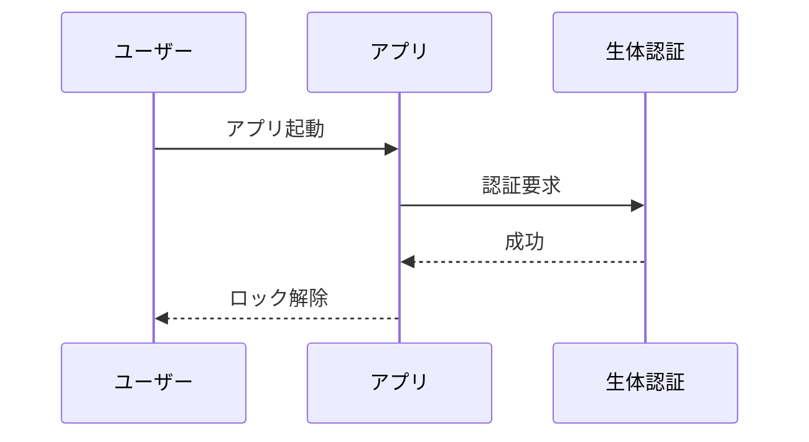

# Notion Preview 全機能デモ

[English version here](./feature-demo.en.md)

この1ファイルで拡張機能の全機能を順番に確認できます。**まずこのファイルで `Cmd+K N`(またはエディタ右上のプレビューアイコン)を押してプレビューを開いてください。**

> [!TIP]
> 各セクションの見出し左に出る ▾ で折りたたみ、見出し右の # でアンカーリンクをコピーできます。

## 1. ツールバー(プレビュー上部)

プレビュー上部のツールバーで以下が試せます:

| ボタン | 機能 |
| --- | --- |
| ☰ | アウトライン(目次)の表示切り替え |
| ⊟ / ⊞ | 全セクションの折りたたみ / 展開 |
| A− / A / A+ | 文字サイズの縮小 / リセット / 拡大 |
| 🔍 | プレビュー内検索(`Cmd/Ctrl+F` でも開く) |
| ⟷ | ページ幅のワイド / 標準切り替え |
| ◐ | **ライト / ダークテーマの切り替え**(設定に保存され全パネル連動) |
| diff | **git 変更ハイライト**: 前回コミット以降の変更ブロックに緑バー、削除箇所に展開可能な赤チップ |

スクロールすると上端に読書プログレスバー、右下に「トップへ戻る」ボタンが出ます。

## 2. プレビュー内検索

`Cmd/Ctrl+F` を押して「デモ」で検索してみてください。全ヒットが黄色にハイライトされ、Enter / Shift+Enter で前後のヒットへ移動します(現在位置はオレンジ)。折りたたみ中のセクション内のヒットへも自動展開してジャンプします。

## 3. 双方向スクロール同期

エディタとプレビューを並べた状態で、**どちらをスクロールしてももう片方が追従**します。プレビュー側のブロックはソース行と紐付いています。

## 4. テキスト装飾と引用

**太字**、_斜体_、~~取り消し~~、`インラインコード`、[外部リンク](https://code.visualstudio.com)(クリックでブラウザが開く)。

> 引用ブロック。ライトモードでもダークモードでも、左のバーがテキスト色由来のグレーで正しく表示されます(v0.9.4 で修正)。
> 複数行の引用もこの通り。

---

## 5. リスト・タスクリスト

- 通常の箇条書き
  - ネストも可能
1. 番号付きリスト
2. 二つ目

- [ ] このチェックボックスは**プレビュー上でクリックすると md ソースが書き換わります**(Cmd+Z で取り消し可)
- [x] 完了済みタスク

## 6. コールアウト(GitHub / Obsidian 形式)

> [!NOTE]
> 補足情報。`> [!NOTE]` 形式で書きます。

> [!TIP]
> ヒント。5種類すべて色分きの Notion 風カードになります。

> [!IMPORTANT]
> 重要事項。

> [!WARNING]
> 警告。

> [!CAUTION]
> 危険・注意。

## 7. コードブロック(Shiki ハイライト + コピー)

言語ラベルと Copy ボタン付き。テーマのライト/ダークに追従します(◐ で切り替えて確認してみてください)。

```tsx
export function useAppLock(): AppLockState {
  const [status, setStatus] = useState<LockStatus>('locked');

  useEffect(() => {
    if (status === 'locked') {
      void authenticate(); // 生体認証 → 失敗時は PIN モーダルへ
    }
  }, [status]);

  return { status, authenticate, lock };
}
```

```bash
# シェルスクリプトもこの通り
npm run build && npm test
```

## 8. 数式(KaTeX・ローカルバンドル)

インライン: 質量エネルギー等価性 $E = mc^2$、二次方程式の解は $x = \frac{-b \pm \sqrt{b^2 - 4ac}}{2a}$。

ブロック数式:

$$
\int_{-\infty}^{\infty} e^{-x^2} \, dx = \sqrt{\pi}
$$

誤検出チェック: 開発費は $5 と $10 でした(文中のドル記号は数式になりません)。

## 9. Mermaid ダイアグラム(ローカルレンダリング・CDNなし)

ブロック右上のツールで **パン/ズーム・SVG保存・ソース表示** ができ、クリックでライトボックス拡大します。



## 10. テーブル

| 機能 | 追加バージョン | 設定キー |
| --- | --- | --- |
| テーマ切り替え | 0.9.4 | `notionPreview.theme` |
| 複数プレビュー | 0.9.4 | — |
| 検索 | 0.10.0 | — |
| 数式 | 0.10.0 | `notionPreview.enableMath` |
| プロパティ表示 | 0.10.0 | `notionPreview.showFrontmatter` |
| リンクをプレビューで開く | 0.10.0 | `notionPreview.openLinksInPreview` |

## 11. frontmatter プロパティ

このページ先頭に表示されている **title / version / status / tags / reviewed / updated** が YAML frontmatter 由来のプロパティブロックです。tags はチップ、reviewed は ☑ で表示されます。ブロックをクリックすると frontmatter をそのまま編集できます。

※現状対応しているのは YAML frontmatter(Obsidian 等の形式)です。Notion 本体の md エクスポート(タイトル直下の `Key: Value` 行)は未対応。

## 12. ブロック操作(Notion 風)

- ブロックにホバーすると左に ⠿ グリップが出ます。**ドラッグで並べ替え**でき、md ソースに書き戻されます
- ブロックを**クリックするとその場で raw Markdown を編集**できます(Cmd+Enter 確定 / Esc キャンセル)
- どちらも `Cmd+Z` / `Cmd+Shift+Z` で取り消し・やり直しできます(フォーカスはプレビューに残ります)

## 13. 複数プレビュー & リンクをプレビューで開く

次のリンクをクリックすると、**エディタではなく別のプレビューパネル**が開きます(パネルは各ファイルに固定され、複数枚並べられます):

- [生体認証アプリロック仕様書を開く](./spec-biometric-app-lock.md)
- アンカー付き(正確なID): [3. 技術仕様へ](./spec-biometric-app-lock.md#3-技術仕様)
- アンカー付き(見出しテキストで解決): [概要へ](./spec-biometric-app-lock.md#概要)

ページ内アンカーの例: [→ 8. 数式セクションへ](#8-数式katexローカルバンドル)

## 14. 画像

ローカル画像は Notion 風の中央寄せ+キャプション付きで表示されます。**クリックするとライトボックスで拡大**でき、スクロールでズーム・ドラッグでパンできます:


存在しない画像は壊れた表示ではなく専用ブロックになります(外部URL画像もセキュリティ方針でブロックされ、同様の表示になります):


