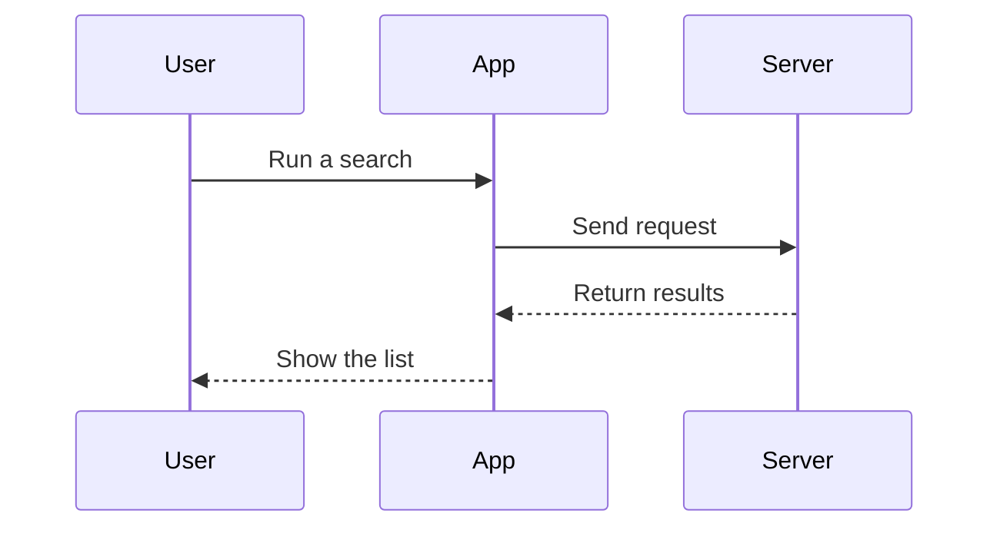

# Notion Preview — All Features Demo

[日本語版はこちら](./feature-demo.ja.md)

This single file walks through every feature of the extension. **Start by opening the preview for this file with `Cmd+K N` (or the preview icon in the editor title bar).**

> [!TIP]
> Hover a heading to reveal ▾ (collapse the section) on the left and # (copy an anchor link) on the right.

## 1. Toolbar (top of the preview)

| Button | Feature |
| --- | --- |
| ☰ | Toggle the outline (table of contents) |
| ⊟ / ⊞ | Collapse / expand all sections |
| A− / A / A+ | Decrease / reset / increase font size |
| 🔍 | Find in preview (also `Cmd/Ctrl+F`) |
| ⟷ | Toggle wide / normal page width |
| ◐ | **Toggle light / dark theme** (saved to settings, applies to all panels) |
| diff | **Git change highlights**: green bars on blocks changed since the last commit, expandable red chips where content was deleted |

While scrolling you also get a reading-progress bar at the top and a "back to top" button at the bottom right.

## 2. Find in preview

Press `Cmd/Ctrl+F` and search for "demo". Every match is highlighted in yellow, Enter / Shift+Enter jumps between matches (the current one is orange). Hits inside collapsed sections are expanded automatically.

## 3. Two-way scroll sync

With the editor and the preview side by side, **scrolling either one scrolls the other** to the matching position. Every block in the preview is mapped to its source line.

## 4. Text formatting & quotes

**Bold**, _italic_, ~~strikethrough~~, `inline code`, [external link](https://code.visualstudio.com) (opens in your browser).

> A blockquote. The bar on the left is derived from the text color, so it renders correctly in both light and dark mode (fixed in v0.9.4).
> Multi-line quotes work too.

---

## 5. Lists & task lists

- Bullet list
  - Nesting works
1. Numbered list
2. Second item

- [ ] **Click this checkbox in the preview** — it rewrites the Markdown source (undo with Cmd+Z)
- [x] A completed task

## 6. Callouts (GitHub / Obsidian style)

> [!NOTE]
> Additional information, written as `> [!NOTE]`.

> [!TIP]
> A tip. All five kinds render as color-coded Notion-style cards.

> [!IMPORTANT]
> Something important.

> [!WARNING]
> A warning.

> [!CAUTION]
> Danger / caution.

## 7. Code blocks (Shiki highlighting + copy)

Language label and a Copy button. The syntax theme follows light/dark — try toggling with ◐.

```tsx
export function useTodos(): TodoState {
  const [todos, setTodos] = useState<Todo[]>([]);

  const add = (text: string) => {
    setTodos((prev) => [...prev, { id: crypto.randomUUID(), text, done: false }]);
  };

  const toggle = (id: string) => {
    setTodos((prev) =>
      prev.map((t) => (t.id === id ? { ...t, done: !t.done } : t)),
    );
  };

  return { todos, add, toggle };
}
```

```bash
# Shell scripts too
npm run build && npm test
```

## 8. Math (KaTeX, bundled locally)

Inline: mass–energy equivalence $E = mc^2$, and the quadratic formula $x = \frac{-b \pm \sqrt{b^2 - 4ac}}{2a}$.

Block math:

$$
\int_{-\infty}^{\infty} e^{-x^2} \, dx = \sqrt{\pi}
$$

False-positive check: this feature cost $5 and $10 (dollar amounts in prose are not treated as math).

## 9. Mermaid diagrams (rendered locally, no CDN)

Use the tools at the top right of the block to **pan/zoom, save as SVG, or view the source**. Click the diagram for a lightbox zoom.



## 10. Tables

| Feature | Added in | Setting |
| --- | --- | --- |
| Theme toggle | 0.9.4 | `notionPreview.theme` |
| Multiple previews | 0.9.4 | — |
| Find in preview | 0.10.0 | — |
| Math | 0.10.0 | `notionPreview.enableMath` |
| Frontmatter properties | 0.10.0 | `notionPreview.showFrontmatter` |
| Open links in preview | 0.10.0 | `notionPreview.openLinksInPreview` |

## 11. Frontmatter properties

The **title / version / status / tags / reviewed / updated** block at the top of this page comes from the YAML frontmatter. Tags render as chips, booleans as ☑. Click the block to edit the frontmatter in place.

Note: YAML frontmatter (the Obsidian-style `---` block) is supported. Notion's own Markdown export (plain `Key: Value` lines under the title) is not yet.

## 12. Block operations (Notion style)

- Hover a block to reveal the ⠿ grip on the left — **drag to reorder**; the change is written back to the Markdown source
- **Click a block to edit its raw Markdown in place** (Cmd+Enter to commit, Esc to cancel)
- Both are undoable with `Cmd+Z` / `Cmd+Shift+Z` (focus stays in the preview)

## 13. Multiple previews & links opening in preview

Clicking these links opens **another preview panel** (each panel stays pinned to its file, and you can keep several open):

- [Open a sample document](./linked-doc.md)
- With an anchor (exact ID): [to section 3](./linked-doc.md#3-詳細)
- With an anchor (resolved by heading text): [to the overview](./linked-doc.md#概要)

In-page anchor example: [→ jump to the math section](#8-math-katex-bundled-locally)

## 14. Images

Local images render centered with a caption, Notion style. **Click to zoom** in a lightbox (scroll to zoom, drag to pan):


Missing images become a dedicated block instead of a broken image (external URL images are blocked by the security policy and shown the same way):


