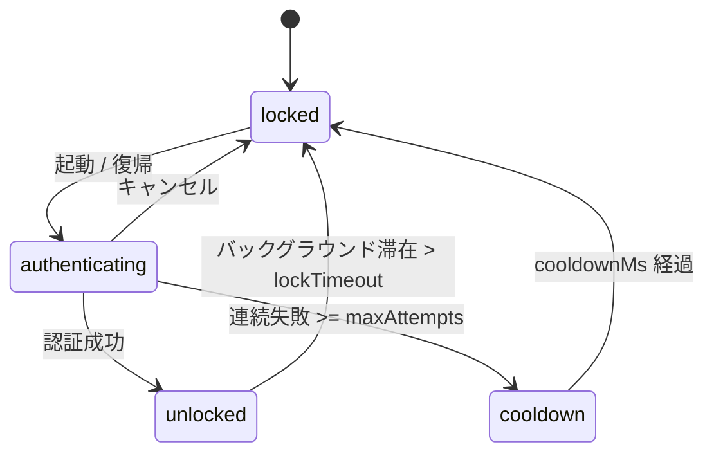
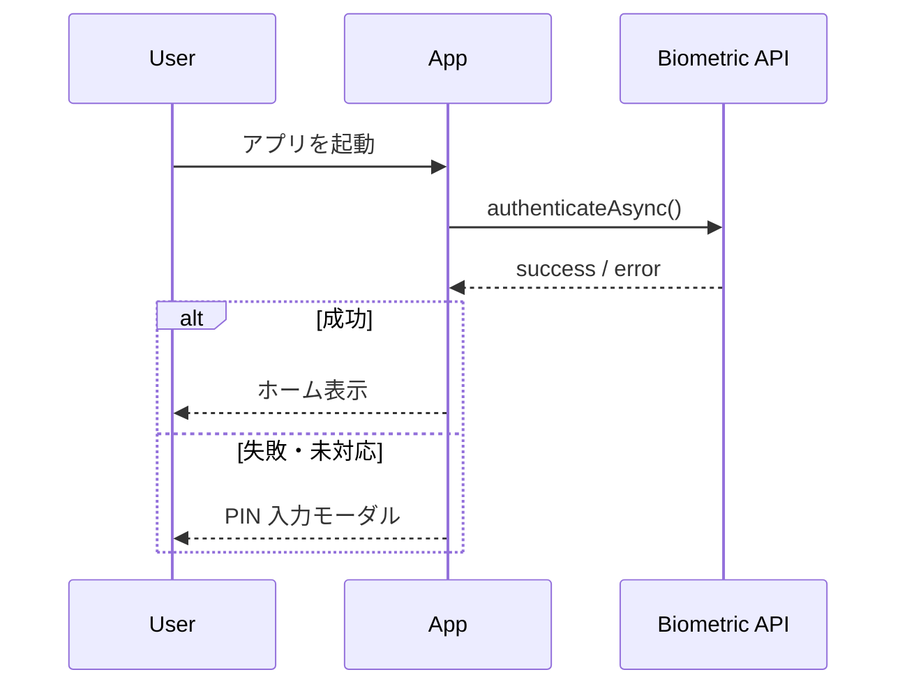

# モバイル版 生体認証アプリロック 仕様書

**対象Story:** [アプリ起動時に生体認証でロック解除できる](./stories/biometric-app-lock.md)
**StoryID:** `7f2b9c14-3ad1-4e8b-9c22-0db1f4a6e510`
**対象アプリ:** `apps/mobile/app`
**ステータス:** Draft
**工数目安:** 3pt
**先行Story:**

- [初回オンボーディングでPINを設定できる](./onboarding-pin-setup.md)
- セキュア領域へのトークン保存（別途Story化されている想定）

---

## 1. 概要

モバイルアプリに、起動時・バックグラウンド復帰時に **生体認証（Face ID / Touch ID / Android BiometricPrompt）** でロックを解除する機能を追加する。個人の日記・メモといったプライベートな情報を扱うアプリのため、端末を一時的に他人に渡してもアプリ内が覗かれないようにすることが目的。

生体認証が使えない・失敗した場合は、フォールバックとして **PINコード** による解除を提供する。

> [!IMPORTANT]
> 生体情報そのものはOSのセキュアエンクレーブが保持し、アプリは一切受け取らない。アプリは「認証成功/失敗」の結果のみを扱う。

**本Storyのスコープ外:**

- PIN設定フローの実装（先行Story）
- サーバー側セッションの即時失効（別Story）
- 特定ノートの個別ロック（別Story）

---

## 2. 機能要件

| 項目         | 内容                                                                 |
| ------------ | -------------------------------------------------------------------- |
| 起動時ロック | コールドスタート時に必ずロック画面を表示                             |
| 復帰時ロック | バックグラウンド滞在が `lockTimeout` を超えたら復帰時にロック        |
| 認証方式     | 生体認証を優先、失敗・未対応時はPINにフォールバック                  |
| 失敗時挙動   | 5回連続失敗でPIN必須、さらに失敗でクールダウン                       |
| 設定         | 設定画面でロックの ON/OFF と `lockTimeout` を変更可能                |
| 即時ロック   | アプリスイッチャー表示時はスナップショットを隠す（内容を見せない）   |

---

## 3. 技術仕様

### 3.1 認証フック

`expo-local-authentication` をラップした `useAppLock` フックを用意し、画面側は状態だけを購読する。

```tsx
const { status, authenticate, lock } = useAppLock();

useEffect(() => {
  if (status === "locked") {
    void authenticate(); // 生体 → 失敗時は PIN モーダルへ
  }
}, [status]);
```

> [!NOTE]
> `authenticate()` は冪等にする。連打や復帰イベントの多重発火で認証ダイアログが二重に出ないよう、進行中フラグでガードする。

### 3.2 既存のモバイル実装

| 機能                 | パス                                                                                       |
| -------------------- | ------------------------------------------------------------------------------------------ |
| アプリ起動ルート     | [src/app/_layout.tsx](../../src/app/_layout.tsx)                                            |
| セキュアストレージ   | [src/lib/secureStore.ts](../../src/lib/secureStore.ts)                                      |
| PIN入力コンポーネント | [src/features/auth/components/PinPad.tsx](../../src/features/auth/components/PinPad.tsx)    |
| アプリ状態の監視     | [src/hooks/useAppState.ts](../../src/hooks/useAppState.ts)                                  |

### 3.3 型定義

```ts
type LockStatus = "unlocked" | "locked" | "authenticating" | "cooldown";

interface AppLockConfig {
  enabled: boolean;
  lockTimeoutMs: number;   // 既定 30_000
  maxAttempts: number;     // 既定 5
  cooldownMs: number;      // 既定 30_000
}
```

### 3.4 設定の保存形式

ロック設定はセキュアストレージに JSON で保存する。

```json
{
  "enabled": true,
  "lockTimeoutMs": 30000,
  "maxAttempts": 5,
  "cooldownMs": 30000
}
```

### 3.5 動作確認用コマンド

```bash
# iOS シミュレータで Face ID 成功/失敗をトグル
xcrun simctl ui booted biometric matchKnown
xcrun simctl ui booted biometric nomatch
```

---

## 4. 状態遷移

ロックの状態機械は以下の通り。`authenticating` を独立させることで、ダイアログ表示中の多重起動を防ぐ。



### 4.1 認証シーケンス



---

## 5. UI仕様

### 5.1 ロック画面構成

```
┌──────────────────────────────┐
│                              │
│            🔒                 │
│        アプリをロック中         │
│                              │
│      [ Face ID で解除 ]        │
│       PIN で解除する          │
│                              │
└──────────────────────────────┘
```

### 5.2 表示要素

- **アプリロゴ / ロックアイコン**
- **解除ボタン**（生体認証を再試行）
- **PINで解除するリンク**（フォールバック導線）
- 失敗時の**残り試行回数**の表示

### 5.3 エラー・状態別表示

| 状態             | 表示                                             |
| ---------------- | ------------------------------------------------ |
| 生体未登録       | 「PINで解除」のみ表示                            |
| 連続失敗         | 残り試行回数と注意メッセージ                     |
| クールダウン中   | 「しばらくしてからお試しください」＋カウントダウン |
| 端末非対応       | 自動でPIN入力にフォールバック                    |

> [!TIP]
> アプリスイッチャー（マルチタスク画面）のサムネイルは、`AppState` が `inactive` になった瞬間に目隠しビューを被せると、OSスナップショットに機微情報が写り込まない。

> [!WARNING]
> `lockTimeout` を長くしすぎると、端末を渡した相手にアプリ内を見られるリスクが上がる。既定は 30 秒、最大でも 5 分までに制限する。

> [!CAUTION]
> ルート化 / Jailbreak 端末では生体認証の信頼性が下がる。検知できた場合はPIN必須に切り替える。

---

## 6. 受け入れ基準（Story AC と同一）

- [ ] アプリのコールドスタート時にロック画面が表示される
- [ ] 生体認証に成功するとホーム画面に遷移する
- [ ] 生体認証に失敗・未対応の場合、PIN入力にフォールバックできる
- [ ] バックグラウンド滞在が `lockTimeout` を超えた場合、復帰時に再ロックされる
- [ ] 5回連続失敗でクールダウン状態になり、一定時間ロック解除できない
- [ ] 設定画面からロックの ON/OFF と `lockTimeout` を変更できる
- [ ] アプリスイッチャーのサムネイルにアプリ内容が表示されない

---

## 7. 参考リンク

### モバイル側

- [src/app/_layout.tsx](../../src/app/_layout.tsx)
- [src/features/auth/components/PinPad.tsx](../../src/features/auth/components/PinPad.tsx)
- [src/lib/secureStore.ts](../../src/lib/secureStore.ts)

### 関連Story

- 先行: [初回オンボーディングでPINを設定できる](./onboarding-pin-setup.md)
- 関連: [特定ノートの個別ロック](./per-note-lock.md)

### 外部仕様

- expo-local-authentication: https://docs.expo.dev/versions/latest/sdk/local-authentication/
- Android BiometricPrompt: https://developer.android.com/jetpack/androidx/releases/biometric
