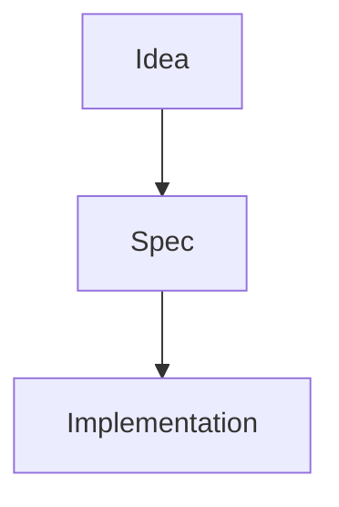

# 要件定義書：Notion-like Markdown Preview for VS Code

- **Document version**: v0.1
- **Created**: 2026-06-24
- **Author**: ChatGPT / PM・SE draft
- **Target**: VS Code 拡張機能
- **Working product name**: Notion-like Markdown Preview
- **Primary user**: Markdown / Notion export を VS Code 上で読みながら開発したいエンジニア・PM・個人開発者

---

## 1. エグゼクティブサマリー

本プロダクトは、Markdown ファイルおよび Notion からエクスポートした Markdown を、VS Code 内で **Notion 風の読みやすい UI** として表示する拡張機能である。

Notion のブロック編集、ドラッグ＆ドロップ、Database、コメント、共有機能は再実装しない。編集・共同編集・情報整理の責務は Notion または通常の Markdown 編集に委ね、本拡張は **VS Code 内で完結する閲覧体験** に集中する。

最初の MVP では、`.md` ファイルを開いた状態でエディタ右上のボタンから Notion 風プレビューを表示できるようにする。続くバージョンで、Mermaid 図、コードブロック、Notion export の画像、コールアウト、チェックボックス、ダークモードに対応する。

---

## 2. 背景・課題

### 2.1 背景

開発者は、要件定義書、PRD、DB 設計、API 設計、調査メモなどを Notion または Markdown で管理することが多い。一方、実装作業は VS Code / Cursor 上で行うことが多く、ドキュメント閲覧と実装環境が分離しがちである。

特に Notion で作成したドキュメントを Markdown export した場合、VS Code 標準の Markdown Preview では情報構造は読めるものの、Notion 特有の余白・視認性・ブロック感・読みやすさは再現されにくい。

### 2.2 現状の課題

- Notion をブラウザやデスクトップアプリで別表示する必要がある。
- VS Code の Markdown Preview は開発者向けで、Notion のようなドキュメント閲覧体験には寄っていない。
- Mermaid 図、コードブロック、コールアウト、テーブル、チェックリストを Notion 風に統一して見たい。
- Notion export の画像パスやスペース入りファイル名が壊れやすい。
- Notion の完全再現を目指すと実装スコープが膨らみすぎる。

### 2.3 解決方針

本拡張では、以下の責務分担を明確にする。

```text
Notion
  = 編集・情報整理・共同編集・データベース管理

Markdown / Notion Export
  = VS Code 上で扱うドキュメントソース

VS Code Extension
  = Notion 風に読むためのプレビュー UI
```

---

## 3. プロダクトゴール

### 3.1 最上位ゴール

Markdown / Notion export を VS Code 内で、Notion に近い読みやすさで閲覧できるようにする。

### 3.2 具体ゴール

- `.md` ファイルからワンクリックで Notion 風プレビューを開ける。
- VS Code 内の WebView 上で完結する。
- Mermaid 図を視覚的に表示できる。
- コードブロックを Notion 風に表示できる。
- Notion export の画像を壊さず表示できる。
- セキュアにローカル Markdown をレンダリングできる。
- Marketplace 公開可能な VS Code 拡張として作る。

### 3.3 成功指標

| 指標 | 初期目標 |
|---|---:|
| Markdown プレビュー起動成功率 | 99% 以上 |
| 1MB 以下の Markdown 初回表示 | 1 秒以内 |
| 主要 Markdown 要素の表示崩れ | 重大崩れ 0 件 |
| Notion export 画像の表示成功率 | 95% 以上 |
| 外部通信 | デフォルト 0 件 |
| MVP の手元利用開始まで | VSIX インストールで完結 |

---

## 4. スコープ

### 4.1 In Scope

本プロダクトで対応する。

- Markdown ファイルの Notion 風プレビュー
- Notion export された Markdown の閲覧
- VS Code エディタ右上のプレビューボタン
- Command Palette からの起動
- WebView Panel による VS Code 内表示
- 保存時の自動プレビュー更新
- 見出し、段落、リスト、引用、テーブル
- タスクチェックボックス
- コードブロック
- Mermaid 図
- Callout 風ブロック
- 画像表示
- 相対パス解決
- Notion export の asset ディレクトリ対応
- ダークモード / ライトモード対応
- CSP、sanitize、localResourceRoots による安全対策
- VSIX パッケージ化
- VS Code Marketplace 公開準備

### 4.2 Out of Scope

初期版では対応しない。

- Notion の完全な UI / 挙動再現
- Notion のブロックエディタ再実装
- ドラッグ＆ドロップによるブロック移動
- `/` コマンド
- Notion Database の完全再現
- 双方向編集
- Notion API との同期
- Notion アカウントログイン
- Notion ページの直接読み込み
- コメント、メンション、共有権限
- リアルタイム共同編集
- Web アプリ版
- モバイル版

---

## 5. 想定ユーザー

### 5.1 Primary Persona: 個人開発者 / Web エンジニア

- VS Code / Cursor をメインで使う。
- Notion に構想・仕様・メモを書く。
- 実装時にドキュメントを右側に表示したい。
- Markdown と Notion export の両方を扱う。

### 5.2 Secondary Persona: PM / PdM / テックリード

- PRD、要件定義、設計書を Markdown で共有する。
- 開発者が読みやすい形式でドキュメントを配布したい。
- Notion 風の読みやすさを維持したい。

### 5.3 Secondary Persona: 技術記事・ドキュメント作成者

- Markdown を VS Code で書く。
- Mermaid やコードを含む記事を確認したい。
- GitHub Preview よりもドキュメントらしい見た目を求める。

---

## 6. ユースケース

### UC-001: Markdown を Notion 風に閲覧する

1. ユーザーが VS Code で `.md` ファイルを開く。
2. エディタ右上の `Open Notion Preview` ボタンを押す。
3. エディタ横に Notion 風プレビューが開く。
4. 見出し、本文、リスト、コード、画像が整った UI で表示される。

### UC-002: Notion export を閲覧する

1. ユーザーが Notion から Markdown + assets をエクスポートする。
2. VS Code で export された `.md` を開く。
3. 本拡張でプレビューする。
4. Markdown 内の相対画像パスが自動解決され、画像が表示される。

### UC-003: Mermaid 図を表示する

1. Markdown 内に ` ```mermaid ` のコードブロックを書く。
2. プレビューを開く。
3. Mermaid 図が Notion 風の埋め込みブロックとして表示される。
4. Mermaid の構文エラーがある場合は、エラー内容をブロック内に表示する。

### UC-004: コードブロックを読む

1. Markdown 内に ` ```ts ` などのコードブロックを書く。
2. プレビューを開く。
3. 言語ラベル付きの Notion 風コードブロックが表示される。
4. ユーザーは copy ボタンでコードをコピーできる。

### UC-005: 保存時にプレビューを更新する

1. ユーザーが Markdown を編集する。
2. ファイルを保存する。
3. 既存のプレビューが自動更新される。

---

## 7. 機能要件

### 7.1 プレビュー起動

| ID | 要件 | 優先度 |
|---|---|---:|
| FR-001 | `.md` ファイルを開いているとき、エディタ右上に `Open Notion Preview` ボタンを表示する。 | Must |
| FR-002 | Command Palette から `Open Notion Preview` を実行できる。 | Must |
| FR-003 | プレビューは現在アクティブな Markdown ファイルを対象にする。 | Must |
| FR-004 | プレビューは `ViewColumn.Beside` で横に開く。 | Must |
| FR-005 | すでに同一ファイルのプレビューが開いている場合、新規作成せず既存 panel を更新・フォーカスする。 | Should |

### 7.2 Markdown レンダリング

| ID | 要件 | 優先度 |
|---|---|---:|
| FR-101 | heading `#`〜`######` を表示できる。 | Must |
| FR-102 | paragraph、bold、italic、inline code を表示できる。 | Must |
| FR-103 | ordered list / unordered list を表示できる。 | Must |
| FR-104 | blockquote を表示できる。 | Must |
| FR-105 | table を表示できる。 | Must |
| FR-106 | link を表示できる。 | Must |
| FR-107 | task list `- [ ]` / `- [x]` を表示できる。 | Should |
| FR-108 | frontmatter は本文に表示しない。 | Should |
| FR-109 | Markdown 内の raw HTML はデフォルト無効にする。 | Must |

### 7.3 Notion 風 UI

| ID | 要件 | 優先度 |
|---|---|---:|
| FR-201 | ページ中央寄せ、最大幅 720〜860px 程度の読みやすいレイアウトにする。 | Must |
| FR-202 | Notion 風の余白、行間、見出しサイズを適用する。 | Must |
| FR-203 | VS Code のライト / ダークテーマに追従する。 | Must |
| FR-204 | テーブルは横スクロール可能にする。 | Should |
| FR-205 | Callout ブロックを Notion 風に表示する。 | Should |
| FR-206 | 画像は本文幅に収めて表示する。 | Must |
| FR-207 | 長いコードブロックは横スクロール可能にする。 | Must |

### 7.4 コードブロック

| ID | 要件 | 優先度 |
|---|---|---:|
| FR-301 | fenced code block を表示できる。 | Must |
| FR-302 | コードブロック上部に言語ラベルを表示する。 | Should |
| FR-303 | copy ボタンを表示する。 | Should |
| FR-304 | Shiki 等で syntax highlight する。 | Should |
| FR-305 | 未対応言語でもプレーンテキストとして表示する。 | Must |

### 7.5 Mermaid

| ID | 要件 | 優先度 |
|---|---|---:|
| FR-401 | `mermaid` 言語の fenced code block を Mermaid 図として描画する。 | Should |
| FR-402 | Mermaid 図を Notion 風カードブロック内に表示する。 | Should |
| FR-403 | Mermaid 構文エラー時はプレビュー全体を落とさず、対象ブロックにエラーを表示する。 | Must |
| FR-404 | Mermaid 描画はデフォルトでローカルバンドルした JS を使用する。 | Must |
| FR-405 | 外部 CDN から Mermaid を読み込まない。 | Must |

### 7.6 Notion export 画像対応

| ID | 要件 | 優先度 |
|---|---|---:|
| FR-501 | Markdown 内の相対画像パスを WebView 用 URI に変換する。 | Must |
| FR-502 | URL エンコードされたスペース、括弧、日本語ファイル名を扱える。 | Must |
| FR-503 | Notion export の同名ディレクトリ構造を解決できる。 | Should |
| FR-504 | `.assets` ディレクトリ構造を解決できる。 | Should |
| FR-505 | 存在しない画像は broken UI ではなく、Notion 風の missing image ブロックを表示する。 | Should |
| FR-506 | ローカルファイル読み込み範囲は `localResourceRoots` で制限する。 | Must |

### 7.7 自動更新

| ID | 要件 | 優先度 |
|---|---|---:|
| FR-601 | 対象 Markdown ファイル保存時にプレビューを更新する。 | Must |
| FR-602 | 設定により、編集中の debounce 更新を有効化できる。 | Could |
| FR-603 | ファイル削除時、プレビューに「ファイルが存在しない」状態を表示する。 | Should |

### 7.8 設定

| ID | 要件 | 優先度 |
|---|---|---:|
| FR-701 | `notionPreview.theme` を提供する。値は `auto`, `light`, `dark`。 | Should |
| FR-702 | `notionPreview.pageWidth` を提供する。 | Could |
| FR-703 | `notionPreview.enableMermaid` を提供する。 | Should |
| FR-704 | `notionPreview.enableRawHtml` を提供する。初期値は `false`。 | Should |
| FR-705 | `notionPreview.updateMode` を提供する。値は `onSave`, `debounced`。 | Could |

### 7.9 エラーハンドリング

| ID | 要件 | 優先度 |
|---|---|---:|
| FR-801 | Markdown 変換エラー時、VS Code 通知と WebView 内エラー表示を行う。 | Must |
| FR-802 | Mermaid エラーは対象 Mermaid ブロック内に閉じ込める。 | Must |
| FR-803 | 画像解決エラーは対象画像ブロック内に閉じ込める。 | Must |
| FR-804 | セキュリティ上危険な HTML は sanitize / escape する。 | Must |

---

## 8. 非機能要件

### 8.1 セキュリティ

| ID | 要件 | 優先度 |
|---|---|---:|
| NFR-001 | WebView には Content Security Policy を設定する。 | Must |
| NFR-002 | script 実行には nonce を使用する。 | Must |
| NFR-003 | raw HTML はデフォルト無効にする。 | Must |
| NFR-004 | Markdown から生成される HTML は sanitize する。 | Must |
| NFR-005 | 外部ネットワークアクセスはデフォルト無効にする。 | Must |
| NFR-006 | ローカルリソース読み込みは対象 Markdown のディレクトリ配下を基本とする。 | Must |
| NFR-007 | 拡張機能はファイル内容を外部サーバーへ送信しない。 | Must |
| NFR-008 | `enableCommandUris` は使わない。 | Must |

### 8.2 パフォーマンス

| ID | 要件 | 優先度 |
|---|---|---:|
| NFR-101 | 1MB 以下の Markdown を 1 秒以内に初回表示する。 | Should |
| NFR-102 | 5MB 超の Markdown では重い可能性を警告する。 | Could |
| NFR-103 | 保存時更新は debounce して過剰再描画を避ける。 | Should |
| NFR-104 | Mermaid 描画は対象ブロック単位で行う。 | Should |

### 8.3 可用性・安定性

| ID | 要件 | 優先度 |
|---|---|---:|
| NFR-201 | 1つのブロックの描画失敗でプレビュー全体を落とさない。 | Must |
| NFR-202 | 複数 Markdown ファイルのプレビューを同時に開ける。 | Could |
| NFR-203 | VS Code 再起動後の panel 復元は初期版では必須としない。 | Won't |

### 8.4 アクセシビリティ

| ID | 要件 | 優先度 |
|---|---|---:|
| NFR-301 | 本文コントラストを十分に確保する。 | Must |
| NFR-302 | copy ボタンは keyboard 操作可能にする。 | Should |
| NFR-303 | 画像の alt テキストを表示に反映する。 | Should |
| NFR-304 | Mermaid 図の元テキストを折りたたみ表示または代替テキストとして参照可能にする。 | Could |

### 8.5 保守性

| ID | 要件 | 優先度 |
|---|---|---:|
| NFR-401 | Markdown 変換、asset 解決、WebView HTML 生成を分離する。 | Must |
| NFR-402 | 主要変換処理には unit test を用意する。 | Should |
| NFR-403 | UI CSS は `media/preview.css` に分離する。 | Must |
| NFR-404 | fixture ベースで Notion export サンプルをテストする。 | Should |

---

## 9. 画面・UX 要件

### 9.1 起動導線

- `.md` ファイルを開いたときのみ、エディタ右上にボタンを表示する。
- ボタン名は `Open Notion Preview` とする。
- Command Palette からも同じ機能を実行可能にする。

### 9.2 プレビュー表示

```text
┌──────────────────────────────┬──────────────────────────────┐
│ document.md                  │ Notion Preview                │
│                              │                              │
│ # API設計                    │ API設計                       │
│                              │ 本文...                       │
│ ```ts                        │ ┌ TypeScript ─────── Copy ┐  │
│ const a = 1                  │ │ const a = 1              │  │
│ ```                          │ └─────────────────────────┘  │
│                              │ ┌ Diagram ────────────────┐  │
│ ```mermaid                   │ │ Mermaid rendered chart   │  │
│ graph TD                     │ └─────────────────────────┘  │
└──────────────────────────────┴──────────────────────────────┘
```

### 9.3 Notion 風デザイン原則

- 余白を広く取る。
- 本文幅を狭めすぎず、読みやすさを優先する。
- ブロックごとに視覚的なまとまりを作る。
- コードや Mermaid はカード風に表示する。
- テーブルは Notion 風の薄い border と hover を使う。
- ダークモードでも過度にコントラストを強くしない。

---

## 10. 技術アーキテクチャ

### 10.1 全体構成

```text
VS Code Extension Host
  ├─ Command registration
  ├─ Preview panel manager
  ├─ Markdown document reader
  ├─ Markdown renderer
  ├─ Asset resolver
  ├─ Security / sanitizer
  └─ WebView HTML generator

VS Code WebView
  ├─ preview.html
  ├─ preview.css
  ├─ preview.js
  ├─ Mermaid renderer
  └─ Copy button handler
```

### 10.2 レンダリングパイプライン

```text
Markdown file
  ↓
Read document text
  ↓
Parse frontmatter
  ↓
Markdown renderer
  ↓
Custom transform
  ├─ code block
  ├─ mermaid block
  ├─ callout
  ├─ task list
  └─ image path
  ↓
Sanitize HTML
  ↓
Inject into WebView HTML
  ↓
Apply Notion-like CSS
  ↓
Run safe WebView scripts
```

### 10.3 推奨ライブラリ

| 用途 | 候補 | 採用方針 |
|---|---|---|
| Markdown parser | `markdown-it` | MVP では実装が簡単なため第一候補 |
| GFM table / task list | `markdown-it` plugin | 必要に応じて追加 |
| Syntax highlight | `shiki` | v0.2 以降で導入 |
| Mermaid | `mermaid` | WebView 側でローカル bundle を読み込む |
| Sanitize | `sanitize-html` または `DOMPurify` | Extension 側または WebView 側で適用 |
| Frontmatter | `gray-matter` | v0.2 以降で導入 |

### 10.4 ディレクトリ構成案

```text
notion-markdown-preview/
  .vscode/
    launch.json
    tasks.json
  fixtures/
    simple.md
    notion-export/
      Project Plan.md
      Project Plan/
        image.png
    mermaid.md
    malicious-html.md
  media/
    preview.css
    preview.js
  src/
    extension.ts
    preview/
      PreviewPanelManager.ts
      createWebviewHtml.ts
      renderMarkdown.ts
      resolveAssets.ts
      transformCallouts.ts
      transformCodeBlocks.ts
      sanitize.ts
      getNonce.ts
    test/
      renderMarkdown.test.ts
      resolveAssets.test.ts
      transformCallouts.test.ts
  package.json
  README.md
  CHANGELOG.md
  LICENSE
```

---

## 11. VS Code 拡張仕様

### 11.1 package.json contribution 案

```json
{
  "activationEvents": [
    "onLanguage:markdown",
    "onCommand:notionPreview.open"
  ],
  "contributes": {
    "commands": [
      {
        "command": "notionPreview.open",
        "title": "Open Notion Preview",
        "icon": "$(open-preview)"
      }
    ],
    "menus": {
      "editor/title": [
        {
          "command": "notionPreview.open",
          "when": "resourceLangId == markdown",
          "group": "navigation"
        }
      ]
    },
    "configuration": {
      "title": "Notion Markdown Preview",
      "properties": {
        "notionPreview.theme": {
          "type": "string",
          "enum": ["auto", "light", "dark"],
          "default": "auto",
          "description": "Preview theme."
        },
        "notionPreview.enableMermaid": {
          "type": "boolean",
          "default": true,
          "description": "Render mermaid code blocks as diagrams."
        },
        "notionPreview.enableRawHtml": {
          "type": "boolean",
          "default": false,
          "description": "Allow raw HTML in markdown. Disabled by default for security."
        },
        "notionPreview.updateMode": {
          "type": "string",
          "enum": ["onSave", "debounced"],
          "default": "onSave",
          "description": "When to update preview."
        }
      }
    }
  }
}
```

### 11.2 extension.ts 最小イメージ

```ts
import * as vscode from 'vscode';
import { PreviewPanelManager } from './preview/PreviewPanelManager';

export function activate(context: vscode.ExtensionContext) {
  const manager = new PreviewPanelManager(context);

  const disposable = vscode.commands.registerCommand('notionPreview.open', async (uri?: vscode.Uri) => {
    const targetUri = uri ?? vscode.window.activeTextEditor?.document.uri;

    if (!targetUri) {
      vscode.window.showWarningMessage('Open a Markdown file first.');
      return;
    }

    const document = await vscode.workspace.openTextDocument(targetUri);

    if (document.languageId !== 'markdown') {
      vscode.window.showWarningMessage('Notion Preview supports Markdown files only.');
      return;
    }

    manager.open(document);
  });

  context.subscriptions.push(disposable);
}

export function deactivate() {}
```

---

## 12. セキュリティ設計

### 12.1 基本方針

Markdown はユーザーが任意に持ち込める入力であるため、信頼しない。

### 12.2 対策

- raw HTML はデフォルト無効。
- Markdown 由来 HTML は sanitize する。
- WebView に CSP を設定する。
- script は nonce 付きのみ許可する。
- 外部 CDN は使用しない。
- Mermaid / CSS / JS は拡張に bundle する。
- 画像読み込みは `localResourceRoots` 配下に制限する。
- ファイル内容を外部へ送信しない。
- `enableCommandUris` は使用しない。

### 12.3 CSP 例

```html
<meta http-equiv="Content-Security-Policy" content="
  default-src 'none';
  img-src vscode-resource: data:;
  style-src 'nonce-{{nonce}}';
  script-src 'nonce-{{nonce}}';
">
```

実装時は VS Code の WebView 仕様に従い、`webview.cspSource` と `asWebviewUri` を使って調整する。

---

## 13. Notion export 対応仕様

### 13.1 想定される構造

```text
Exported Page.md
Exported Page/
  image.png
  image 2.png
```

または、ツールによっては以下のような構造も想定する。

```text
Exported Page.md
Exported Page.assets/
  image.png
```

### 13.2 パス解決ルール

1. Markdown ファイルからの相対パスとして解決する。
2. URL decode を試す。
3. 同名ディレクトリ配下を探索する。
4. `.assets` ディレクトリ配下を探索する。
5. 見つからない場合は missing image UI を表示する。

### 13.3 例

```md

```

変換後は、VS Code WebView で読み込める URI に変換する。

```ts
const webviewUri = panel.webview.asWebviewUri(vscode.Uri.file(resolvedImagePath));
```

---

## 14. Mermaid 表示仕様

### 14.1 入力

````md

````

### 14.2 出力 UI

```text
┌──────────────────────────────┐
│ Diagram                      │
├──────────────────────────────┤
│ A → B → C                    │
└──────────────────────────────┘
```

### 14.3 エラー時

```text
┌──────────────────────────────┐
│ Mermaid syntax error         │
├──────────────────────────────┤
│ Parse error on line 2 ...    │
└──────────────────────────────┘
```

---

## 15. コードブロック表示仕様

### 15.1 入力

````md
```ts
const user = await userRepository.findById(userId);
```
````

### 15.2 出力 UI

```text
┌ TypeScript ─────────── Copy ┐
│ const user = await ...      │
└─────────────────────────────┘
```

### 15.3 要件

- 言語名を表示する。
- Copy ボタンを表示する。
- 横スクロール可能にする。
- Syntax highlight は v0.2 以降で対応する。
- 未対応言語は plain text として安全に表示する。

---

## 16. Callout 表示仕様

### 16.1 入力形式

```md
> [!NOTE]
> これはメモです。

> [!WARNING]
> 注意してください。
```

### 16.2 出力 UI

```text
💡 これはメモです。
⚠️ 注意してください。
```

### 16.3 対応種別

| 記法 | 表示 |
|---|---|
| `[!NOTE]` | メモ |
| `[!TIP]` | Tips |
| `[!IMPORTANT]` | 重要 |
| `[!WARNING]` | 警告 |
| `[!CAUTION]` | 注意 |

---

## 17. 開発フロー

### 17.1 初期セットアップ

```bash
npx --package yo --package generator-code -- yo code
```

選択例：

```text
New Extension (TypeScript)
Extension name: notion-markdown-preview
Bundler: esbuild
Package manager: npm or pnpm
```

### 17.2 ローカル開発

```text
開発用 VS Code
  ↓ F5
Extension Development Host
  ↓
検証用 VS Code で .md を開く
  ↓
Open Notion Preview 実行
  ↓
WebView 表示を確認
```

### 17.3 手元インストール検証

```bash
npm run compile
vsce package
code --install-extension notion-markdown-preview-0.0.1.vsix
```

### 17.4 公開フロー

```text
1. README / CHANGELOG / LICENSE / icon を整備
2. publisher を作成
3. Personal Access Token を用意
4. vsce login
5. vsce package
6. vsce publish
```

---

## 18. マイルストーン

### v0.1: Local MVP

目的：最小限の Notion 風 Markdown preview をローカルで確認できる。

- [ ] VS Code 拡張の雛形作成
- [ ] `Open Notion Preview` コマンド作成
- [ ] editor/title ボタン表示
- [ ] WebView Panel 表示
- [ ] Markdown を HTML に変換
- [ ] Notion 風 CSS 適用
- [ ] 保存時更新

### v0.2: Rich Blocks

目的：コード、テーブル、画像を読みやすくする。

- [ ] コードブロック UI
- [ ] 言語ラベル
- [ ] copy ボタン
- [ ] Shiki syntax highlight
- [ ] テーブル UI
- [ ] 画像表示

### v0.3: Notion Export Support

目的：Notion export を実用レベルで読む。

- [ ] URL decode 対応
- [ ] 同名 asset ディレクトリ対応
- [ ] `.assets` ディレクトリ対応
- [ ] 日本語ファイル名対応
- [ ] missing image UI

### v0.4: Mermaid & Callout

目的：設計書として使いやすくする。

- [ ] Mermaid rendering
- [ ] Mermaid error handling
- [ ] Callout transform
- [ ] Task list UI
- [ ] Dark mode tuning

### v0.5: Alpha VSIX

目的：自分の環境で通常拡張として利用する。

- [ ] VSIX package
- [ ] manual install test
- [ ] README 初版
- [ ] known issues 整理

### v1.0: Marketplace Release

目的：公開利用できる品質にする。

- [ ] Marketplace metadata
- [ ] icon
- [ ] screenshots / GIF
- [ ] CHANGELOG
- [ ] LICENSE
- [ ] security review
- [ ] `vsce publish`

---

## 19. テスト計画

### 19.1 Unit Test

| 対象 | テスト内容 |
|---|---|
| `renderMarkdown` | 基本 Markdown が HTML に変換される |
| `resolveAssets` | 相対パス、URL encoded path、日本語 path を解決できる |
| `transformCallouts` | `[!NOTE]` 等を callout に変換できる |
| `sanitize` | script / unsafe HTML が除去される |
| `getNonce` | nonce が毎回異なる |

### 19.2 Integration Test

- `.md` を開いてプレビューが出る。
- 保存時にプレビューが更新される。
- 画像付き Notion export が表示される。
- Mermaid 図が表示される。
- Mermaid 構文エラーで preview 全体が落ちない。
- raw HTML が実行されない。

### 19.3 Fixture

```text
fixtures/
  simple.md
  code-blocks.md
  mermaid.md
  mermaid-error.md
  callouts.md
  task-list.md
  notion-export/
    Project Plan.md
    Project Plan/
      image.png
  japanese-path/
    設計書.md
    設計書/
      画像 1.png
  malicious-html.md
```

### 19.4 受け入れテスト

| ID | シナリオ | 期待結果 |
|---|---|---|
| AT-001 | `.md` を開いてボタンを押す | 右側にプレビューが開く |
| AT-002 | Markdown を保存する | プレビューが更新される |
| AT-003 | ` ```ts ` を含む | コードブロックが Notion 風に出る |
| AT-004 | ` ```mermaid ` を含む | 図として表示される |
| AT-005 | Notion export の画像を含む | 画像が表示される |
| AT-006 | `<script>alert(1)</script>` を含む | script は実行されない |
| AT-007 | ダークテーマで開く | ダーク用の配色になる |

---

## 20. リスクと対策

| リスク | 影響 | 対策 |
|---|---|---|
| Notion UI の完全再現を求めすぎる | スコープ肥大 | 読み専用プレビューに限定する |
| Notion export の構造差分 | 画像が表示されない | fixture を増やし resolver を段階強化する |
| Mermaid の描画が重い | preview 遅延 | Mermaid block 単位で描画し、エラーを閉じ込める |
| WebView セキュリティ不備 | 任意 script 実行 | CSP / sanitize / raw HTML 無効化 |
| VS Code API 変更 | 互換性問題 | 公式 API に沿って実装し、最小 API に絞る |
| Marketplace 公開準備が面倒 | 公開遅延 | 先に VSIX 配布で検証する |

---

## 21. 意思決定ログ

| ID | 決定 | 理由 |
|---|---|---|
| ADR-001 | Notion 完全再現はしない | 開発コストが大きく、目的とズレるため |
| ADR-002 | VS Code WebView Panel を使う | HTML/CSS/JS で自由に Notion 風 UI を作れるため |
| ADR-003 | Markdown parser は MVP では `markdown-it` | 導入が簡単で初速が出るため |
| ADR-004 | 外部 CDN は使わない | セキュリティとオフライン性を優先するため |
| ADR-005 | Notion API 同期は初期スコープ外 | 認証・同期・権限でスコープが大きくなるため |

---

## 22. Backlog

### Must

- VS Code command
- editor/title button
- WebView preview
- Markdown rendering
- Notion-like CSS
- save update
- basic security

### Should

- Shiki highlight
- Mermaid rendering
- image resolver
- Notion export asset support
- callout support
- task list support
- dark mode
- copy button

### Could

- TOC sidebar
- search in preview
- export as HTML
- print CSS
- custom page width
- font setting
- live debounce rendering
- Custom Editor API support

### Won't for v1

- Notion API sync
- Notion DB rendering
- block editing
- drag and drop
- comment / mention
- cloud sync

---

## 23. Definition of Done

### v0.1 DoD

- `.md` ファイルからプレビューを起動できる。
- Notion 風 CSS が適用されている。
- 保存時に更新される。
- raw HTML が実行されない。
- README にローカル実行方法が書かれている。

### v1.0 DoD

- Mermaid / code / image / callout / task list が実用レベルで表示される。
- Notion export の主要ケースに対応している。
- セキュリティチェックリストを満たしている。
- VSIX として手元インストールできる。
- Marketplace 公開に必要な README / icon / CHANGELOG / LICENSE が揃っている。
- 主要 fixture のテストが通っている。

---

## 24. README 初期構成案

```md
# Notion-like Markdown Preview

Preview Markdown and Notion-exported documents in a clean Notion-like UI inside VS Code.

## Features

- Notion-like Markdown preview
- Code blocks with language label
- Mermaid diagrams
- Notion export image support
- Callouts
- Task lists
- Dark mode

## Usage

1. Open a Markdown file.
2. Click `Open Notion Preview` in the editor title area.
3. View your document in a Notion-like preview tab.

## Security

This extension does not send your document content to external servers.
Raw HTML is disabled by default.
```

---

## 25. 公式参考資料

- VS Code WebView API: https://code.visualstudio.com/api/extension-guides/webview
- VS Code Contribution Points: https://code.visualstudio.com/api/references/contribution-points
- VS Code Commands: https://code.visualstudio.com/api/extension-guides/command
- VS Code Your First Extension: https://code.visualstudio.com/api/get-started/your-first-extension
- VS Code Publishing Extensions: https://code.visualstudio.com/api/working-with-extensions/publishing-extension
- vsce: https://github.com/microsoft/vscode-vsce
- Shiki: https://shiki.style/
- Mermaid: https://mermaid.js.org/

---

## 26. 最終方針

本プロダクトのコア思想は以下で固定する。

```text
Notion を再実装しない。
Notion で書いたもの、または Markdown で書いたものを、
VS Code の中で Notion のように気持ちよく読む。
```

この切り方により、初期開発コストを抑えつつ、エンジニア・PM・個人開発者にとって明確な価値を持つ VS Code 拡張として成立させる。
